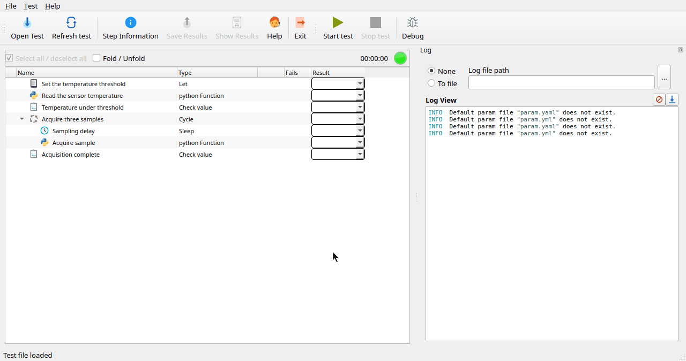

# testium

testium is a YAML-driven test sequencer for hardware-in-the-loop and
integration testing. A test campaign is described in a `.tum` file as a tree
of items (checks, console interactions, Python/Lua functions, parallel blocks,
dialogs, …); testium executes the tree, captures results, and produces
reports in several formats.



## Documentation

* [Quick start](doc/quick_start.md) — install and run your first test in
  five minutes.
* [Tutorial](doc/tutorial.md) — step-by-step tutorial covering the most
  common test items with a runnable example.
* [Exporter tutorial](doc/exporter_tutorial.md) — write and use a custom
  report export format.
* [Debug tutorial](doc/debug_tutorial.md) — debug the Python code of
  your `py_func` items from your IDE.
* [User manual (PDF)](doc/manual/testium_manual.pdf) — full reference.
* [`doc/examples/`](doc/examples/) — runnable `.tum` snippets.

## Install from PyPI

```sh
pip install testium-hil
testium              # GUI mode
testium -b test.tum  # batch mode
```

The PyPI project is named `testium-hil`, after its hardware-in-the-loop
focus; the command and the Python package are named `testium`. Add the
language server for editor support with `pip install 'testium-hil[lsp]'`.

## Pre-built releases

Pre-built artifacts are published at
<https://github.com/testium-HIL/testium/releases>:

* **Python wheel** (`testium_hil-<version>-py3-none-any.whl`) — install with
  `pip install testium_hil-*.whl`. Smaller download than the binary; downloads
  Python dependencies from PyPI during installation.
* **Self-contained Linux binary** (`testium-<version>`, built with PyInstaller) —
  runnable directly, no Python installation required on the host. Lua
  support still needs a system `lua` interpreter and the `lua-socket` /
  `lua-cjson` modules.
* **AppImage** (`Testium-<version>-x86_64.AppImage`) — single-file
  Linux binary, runnable directly:

  ```sh
  chmod +x Testium-*-x86_64.AppImage
  ./Testium-*-x86_64.AppImage
  ```

  Requires `libfuse2` on the host (FUSE 2 — distinct from `fuse3`, which
  most distros now ship by default):

  | Distro | Package |
  |--------|---------|
  | Arch / CachyOS / Manjaro | `fuse2` |
  | Debian trixie / Ubuntu 24.04+ | `libfuse2t64` |
  | Debian bookworm / Ubuntu 22.04 | `libfuse2` |
  | Fedora | `fuse-libs` |

  If you can't install libfuse2 (e.g. minimal container), prefix the
  invocation with `APPIMAGE_EXTRACT_AND_RUN=1` — the AppImage will
  self-extract to `/tmp` on each run instead of FUSE-mounting.
* **Flatpak bundle** (`testium.flatpak`) — install with:

  ```sh
  # Add Flathub (once, to fetch the KDE/PySide runtimes)
  flatpak remote-add --user --if-not-exists flathub https://flathub.org/repo/flathub.flatpakrepo

  # Install the bundle
  flatpak install --user testium.flatpak
  ```

  After installation testium appears in the desktop application menu and the
  `testium` command is available in the terminal (requires `~/.local/bin` in
  `PATH`, which most modern distributions provide by default).

Every channel ships the language server, so `testium lsp` (see
[Editor support](#editor-support)) works from any of them without extra
setup.

## Quick start

From a checkout of the repository
(`git clone https://github.com/testium-HIL/testium.git`):

| OS | Command |
|----|---------|
| Linux | `./run.sh` |
| Windows (cmd) | `run.bat` |
| Windows (PowerShell) | `run.ps1` |

The wrapper creates a Python virtual environment on first run and starts
testium in GUI mode. Add `-b path/to/test.tum` to run a test in batch mode.

## Manual installation

If the wrapper script does not fit your environment, set up testium manually:

```sh
python3 -m venv .venv
source .venv/bin/activate
pip install -r src/requirements.txt
```

Required Python packages (see `src/requirements.txt`):
`pyside6`, `pyserial`, `telnetlib3`, `pyyaml`, `pexpect`, `gitpython`,
`jinja2`, `colorama`, `matplotlib`, `junit-xml`, `lxml`.

For tests using `lua_func` items, install Lua (>= 5.1) plus the `socket` and
`cjson` modules. On Debian/Ubuntu:

```sh
sudo apt install lua5.4 lua-socket lua-cjson
```

Run testium:

```sh
python3 src/testium               # GUI
python3 src/testium -b mytest.tum # batch
```

## Editor support

testium ships a Language Server Protocol (LSP) server that gives `.tum` files
completion of item types, hover documentation, and an outline view in any
LSP-capable editor:

```sh
testium lsp        # LSP over stdio, controlled by the editor LSP client
testium schema     # dumps the item/parameter schema as JSON (what the LSP serves)
```

Without the LSP, [`schema/tum.json`](schema/tum.json) is the committed
JSON Schema of `.tum` files: point yaml-language-server at it
(`yaml.schemas` setting, local path or the raw GitHub URL) for
completion and validation in any YAML-capable editor.

The server is bundled in every pre-built release (wheel, binary, Flatpak,
AppImage). For a source / wheel install, install the language-server
extra:

```sh
pip install 'testium-hil[lsp]'             # from PyPI / a wheel
pip install -e /path/to/testium/src[lsp]   # from a source checkout
```

A VSCode / VSCodium client extension (`testium_assist`) wraps `testium lsp`;
the schema is built from testium itself, so new item types and parameters
appear in the editor on the next testium upgrade with no client change.

The extension is published on [Open VSX](https://open-vsx.org/extension/testium/testium-assist),
so in **VSCodium, Cursor, Windsurf, Theia and code-server** it installs from the
Extensions view (search `testium-assist`) or with
`codium --install-extension testium.testium-assist`.

**Microsoft VSCode** does not list Open VSX extensions, so install the `.vsix`
by hand — download it from the Open VSX page above, then *Extensions → ⋯ →
Install from VSIX…* or:

```sh
code --install-extension testium-assist-<version>.vsix
```

The extension runs `testium lsp`, so `testium` must be on the `PATH` (otherwise
point the `testium.serverPath` setting at the binary/AppImage).

## Troubleshooting

### A `pytest` item fails to load

```
'pytest' item ... could not be loaded: pytest is not installed on the host interpreter
```

Install pytest with the host Python — the `python_bin` interpreter, the
same one running `py_func` steps: `<python_bin> -m pip install pytest`.
The same rule applies to the dependencies of `py_func` scripts and to
report exporter plugins: they are installed beside testium, never inside
it.

### `wl_proxy_marshal_flags` symbol error (Wayland session)

```
testium: symbol lookup error: ... undefined symbol: wl_proxy_marshal_flags
```

The self-contained binary can hit a Qt/Wayland library mismatch on some
distributions. Force the X11 Qt backend (`export QT_QPA_PLATFORM=xcb`),
or use the AppImage or Flatpak, which bundle their platform libraries.

### Qt platform plugin `xcb` missing

```
qt.qpa.plugin: Could not load the Qt platform plugin "xcb"
```

pip-installed PySide6 needs `libxcb-cursor0` on minimal Debian/Ubuntu
systems:

```sh
sudo apt install libxcb-cursor0
```

## License

Copyright © 2025-2026 François Dausseur.

testium is distributed under the **European Union Public Licence v. 1.2
(EUPL-1.2)** — see [`LICENSE`](LICENSE) for the full text. SPDX:
`EUPL-1.2`.

Contributions are accepted under the same licence as the project.
See [`CONTRIBUTING.md`](CONTRIBUTING.md) for development setup, debugging
workflow, and the release procedure.
