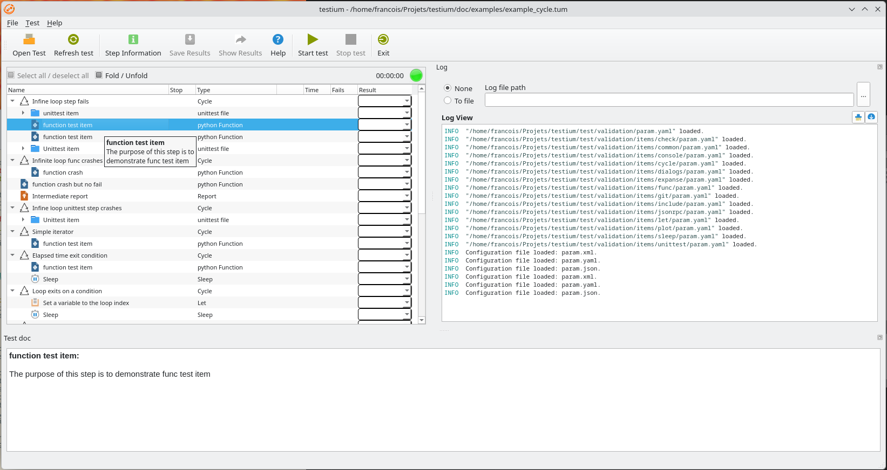

Test outputs
----------------

A list of test result outputs is automatically updated by *testium*.

This is a member of global variables dataset which key is ``test_outputs``.

This global_dict member contains the log file path and, if configured,
the report path as a list.

Other custom logged files may be added by user updated this global variables entry.

Post execution
------------------

A post execution script can be run for example to copy the output files.

For that, a ``post_execution`` element can be defined in the .tum file.

If the test set execution succeeded the ``post_exec`` function of file_name module is run else the ``post_exec_fail`` is run.

If the post_execution element is not defined, the post_execution.py file in the test directory is used by default if existing.

.. code-block:: yaml
    :caption: custom post execution python file

    post_execution:
        file_name: test_report_text.py

Sub-sequence references
-------------------------

It is possible to alias any part of the TUM description file (typically a sequence of steps to be executed) to be inserted within another sequence.

This feature uses the anchor/alias mechanism of the ``YAML`` `language <https://yaml.org/>`_.

Here is an implementation example of a reference to a sub-sequence in a TUM file:

.. code-block:: yaml
    :caption: sub-sequences call

    sequence: &temperature_step_sequence
        - test_item:
            name: test_2
        - test_item:
            name: test_3

    main:
        name: Test example
        steps:
            - test_item1:
                name: test_1
            - *temperature_step_sequence

.. note::
    The entry before the alias (``sequence``: in the example above) is needed
    mandatorily by YAML language syntax. Nevertheless, its value is not
    used by *testium* and thus can be any value.

Test documentation
--------------------

It is possible to display some explicative text user in the GUI.

The ``doc`` attribute of test items is used for that purpose and is displayed as
a tooltip on the test row.

.. code-block:: yaml
    :caption: tests documentation

    main:
        name: Test example
        steps:

            - unittest_file:
                name: unittest item
                doc: |
                    The purpose of this unittest test item is to demonstrate
                    its various features.
                test_file: dummy/dummy.py
                test_method: test_01_pass

See illustration in :numref:`Figure %s<doc-illustration>`.

    Illustration of the ``doc`` attribute effect in the GUI.

Unittest
^^^^^^^^^

For ``unittest_file`` type test items, the python docstring of the test method is used as documentation.
