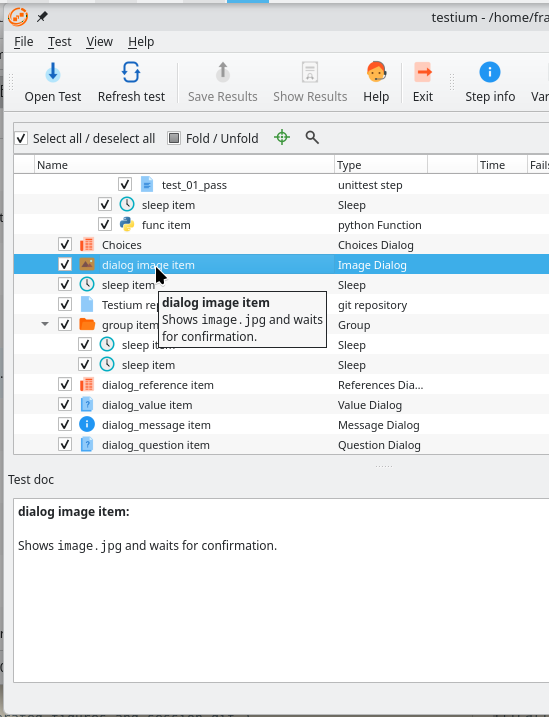

Test outputs
----------------

A list of test result outputs is automatically updated by *testium*.

This is an entry of the global variables dataset whose key is ``test_outputs``.

This global_dict member contains the log file path and, if configured,
the report path as a list.

The user can add other logged files by updating this global variables entry.

Post execution
------------------

A post execution script can be run for example to copy the output files.

For that, a ``post_execution`` element can be defined in the .tum file.

If the test run succeeds, the ``post_exec`` function of the ``file_name`` module is run; otherwise ``post_exec_fail`` is run.

If the post_execution element is not defined, the post_execution.py file in the test directory is used by default if it exists.

.. code-block:: yaml
    :caption: custom post execution python file

    post_execution:
        file_name: test_report_text.py

Sub-sequence references
-------------------------

It is possible to alias any part of the TUM description file (typically a sequence of steps to be executed) to be inserted within another sequence.

This feature uses the anchor/alias mechanism of the ``YAML`` `language <https://yaml.org/>`_.

Here is an implementation example of a reference to a sub-sequence in a TUM file:

.. code-block:: yaml
    :caption: sub-sequences call

    sequence: &temperature_step_sequence
        - test_item:
            name: test_2
        - test_item:
            name: test_3

    main:
        name: Test example
        steps:
            - test_item1:
                name: test_1
            - *temperature_step_sequence

.. note::
    The entry before the alias (``sequence``: in the example above) is
    required by YAML syntax. However, its value is not used by *testium*
    and can be anything.

Test documentation
--------------------

It is possible to display explanatory text in the GUI.

The ``doc`` attribute of test items is used for that purpose and is displayed as
a tooltip on the test row.

.. code-block:: yaml
    :caption: tests documentation

    main:
        name: Test example
        steps:

            - unittest:
                name: unittest item
                doc: |
                    The purpose of this unittest test item is to demonstrate
                    its various features.
                test_file: dummy/dummy.py
                test_method: test_01_pass

See illustration in :numref:`Figure %s<doc-illustration>`.

    Illustration of the ``doc`` attribute effect in the GUI.

Unittest
^^^^^^^^^

For ``unittest`` type test items, the python docstring of the test method is used as documentation.

Running several testium instances
---------------------------------

Several testium instances can run at the same time on the same machine.

* Settings are merged per key when an instance closes: each instance only
  writes back what it changed.
* The GUI keeps the tree state (folds, checkboxes, breakpoints) and the
  log file choice per test file, for the last 20 files opened.
* Output paths written in the ``.tum`` (reports, plot files, ``json_rpc``
  UDP reception ports) are not made unique: tests run in parallel must
  use distinct values.
* If the ``py_func`` debug port is busy, the next free one is used and
  announced in the test log.

Window layout
-------------

The Log, Test doc, Step info and Variables panels are dockable: drag a
panel by its title bar to any side, below the tree, below the log, or
drop it on another panel to tab them. Panels close from their title bar;
the View menu lists them and can reset the layout. The arrangement is
saved on exit, also during a run.

The tree header holds a follow button (the tree scrolls with the running
step; scrolling by hand disengages) and a magnifier opening the step
search. The Result column shows the last message on one line: click it
for the dated failure history, hover it for the full text.
