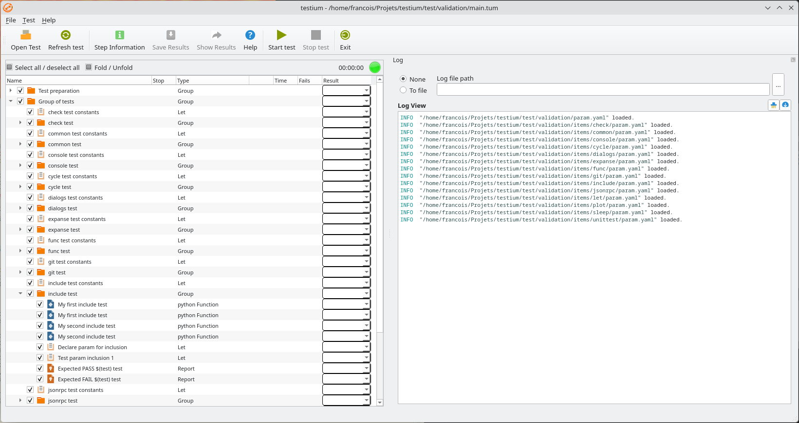

Overview
========

*testium* is an automated test framework developed in python by François Dausseur.
This software is developed in python and it implements the Qt6 graphical framework.

It has been developed since 2013 with production and development testing in mind.

It's function is to automate the execution of tests. It can be invoked either as command line terminal application or as a graphical interface application.

Tests reports generation and customization are also in this tool's scope.

Its main features are:

* YAML test description,
* Test configuration files in YAML, JSON or XML,
* Full range of pre-existing Test items,
* Test steps, loops,
* Dynamic variables expansion at test runtime,
* Conditional test step execution,
* Modularity of tests (reusable test sequences),
* etc.

All these features give the ability to the test engineer to perform efficient and robust testings.

   testium

Each test is described with the help of a `YAML <https://yaml.org/>`_ file having .tum as extension.
This file is analyzed and then displayed as a tree in a graphical way in the
GUI (see Figure above).
