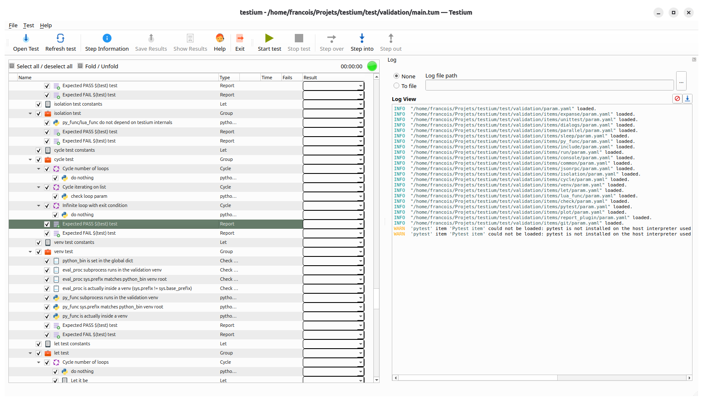

Overview
========

*testium* is an automated test framework written in Python by François Dausseur.
It uses the Qt6 graphical framework.

It has been developed since 2013 with production and development testing in mind.

Its function is to automate the execution of tests. It can be invoked either as command line application or as a graphical interface application.

Sources and pre-built releases are hosted at
`github.com/testium-HIL/testium <https://github.com/testium-HIL/testium>`_.

The tool also generates test reports and lets you customize them.

Its main features are:

* YAML test description,
* Test configuration files in YAML,
* Full range of pre-existing Test items,
* Test steps, loops,
* Dynamic variables expansion at test runtime,
* Conditional test step execution,
* Modularity of tests (reusable test sequences),
* etc.

These features let the test engineer write efficient and robust tests.

   testium

Each test is described with the help of a `YAML <https://yaml.org/>`_ file having .tum as extension.
This file is analyzed and then displayed as a tree in the GUI (see Figure above).
