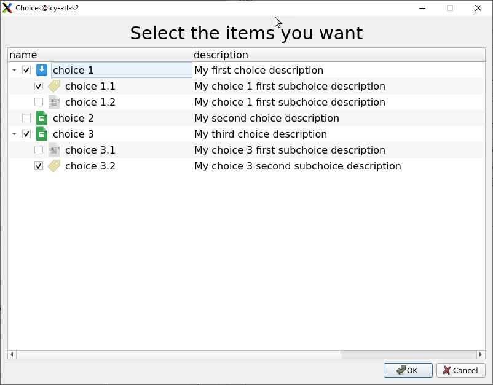

.. _sec_dialog_choices_test_item:

**dialog_choices** test item
============================================================

This test item displays a dialog asking a question and waiting for
a selection to be done among defined list of items.

These selectable items can be passed as a tree.

The :numref:`Figure %s<choices-dialog>` displays an example of this item.

    choices dialog

The item parameters corresponding to :numref:`Figure %s<choices-dialog>`
is shown below.

.. code-block:: yaml
    :caption: example of ``choices_dialog`` test item usage

    - dialog_choices:
        name: Choices
        question: Select the items you want
        icon: $(test_directory)/document.png
        choices:
          - name: choice 1
            description: My first choice description
            icon: $(test_directory)/document-save.png
            choices:
              - name: choice 1.1
                description: My choice 1 first subchoice description
                icon: $(test_directory)/Label.png

              - name: choice 1.2
                description: My choice 1 first subchoice description

          - name: choice 2
            description: My second choice description
            icon: $(test_directory)/image.png

          - name: choice 3
            description: My third choice description
            icon: $(test_directory)/image.png
            choices:
              - name: choice 3.1
                description: My choice 3 first subchoice description

              - name: choice 3.2
                description: My choice 3 second subchoice description
                icon: $(test_directory)/Label.png

Attributes
---------------

The supported attributes of the ``dialog_choices`` test item are:

* ``question``: Question to be displayed in the dialog box.
* ``choices``: List of the choicies presented to the user.
* ``icon``: Optional. Path of the icon used in the
  selection tree, for all the items by default.

``Choices`` attribute content
^^^^^^^^^^^^^^^^^^^^^^^^^^^^^^

Each choice element is a dictionary which can have the following attributes

* ``name``: name of the choice to be done.
* ``description``: description of the choice to be done.
* ``icon``: Optional. Path of the icon displayed in the
  selection tree in front of the corresponding choice.
* ``choices``: List of sub-choicies presented to the user (recursive).

Feature
------------------

The dialog references test item creates the ``cs_<name of test item>`` entry in the
global dictionary.

In the example above, the global variable name containing the
result of the test item would be ``cs_Choices``, and it would contain an
object of this form:

.. code-block::
    :caption: example of result of the ``dialog_choices`` test item

    [
     {'name': 'choice 1',
      'checked': True,
      'choices': [ {'name': 'choice 1.1', 'checked': True},
                   {'name': 'choice 1.2', 'checked': False} ]
     },
     { 'name': 'choice 2',
       'checked': False},
     { 'name': 'choice 3',
       'checked': True,
       'choices': [ {'name': 'choice 3.1', 'checked': False},
                    {'name': 'choice 3.2', 'checked': True} ]
     }
    ]

See :ref:`global variables<sec_global_variables>` for more detail
on how to access to global variables from test items and scripts.