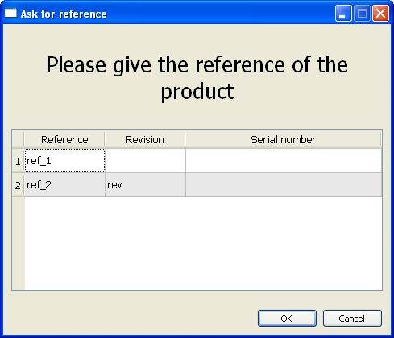

.. _sec_dialog_references_test_item:

**dialog_references** test item
============================================================

This test item displays a dialog asking a question and waiting for
references of the devices under test.

This test item has the following format:

.. code-block:: yaml
    :caption: example of ``dialog_references`` test item usage

    - dialog_references:
        name: ask for a reference
        question: Please give the reference of the product
        reference:
            - ref 1
            - ref 2/rev

The example above displays the dialog box in :numref:`Figure %s<dialog-reference>`.

    dialog reference

Attributes
---------------

``question`` and ``reference`` are mandatory.

* ``question``: Question to be displayed in the dialog box.
* ``reference``: For each of this parameter in the test correspond to a
  row to fill in the dialog.
* ``auto_result``: Optional. Outcome used in batch / non-interactive mode.
  If set, the step succeeds with the pre-filled references; if not set, it fails.

Every field for a reference can be pre-filled using separating
each filed with an '/' (cf :numref:`Figure %s<dialog-reference>`).

Feature
------------------

The dialog references test item creates the ``tested_items`` entry in the
global_dict global variable. This entry is a list of dictionaries of
this form:

.. code-block:: text
    :caption: example of ``tested_items`` global variable result of ``dialog_reference``
              test item

    [{'reference': 'XXXXX', 'revision': 'YYYYY', 'serial': 'ZZZZZ'}, …]